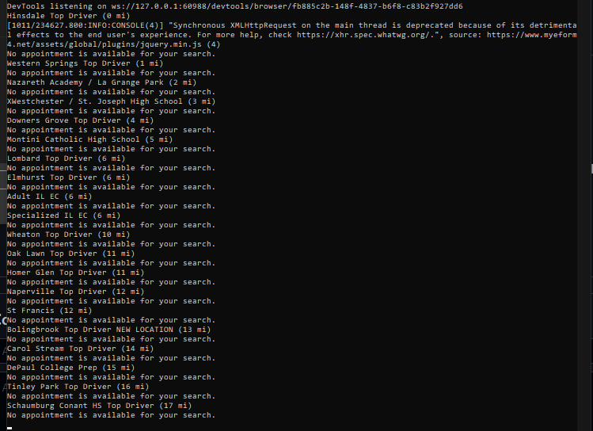

# Appointment Checker for Topdriver
This program will notify you when a new reservation opens up for top driver. This is useful right now because topdriver sessions are fully booked 2 months in advance. So we're looking out for cancellations. This will check every hour.
open the .py file and replace the values in all caps
also open locations.txt and change the location names if you'd like

## Prerequisites:
```
pip install selenium
```

## Directions

Customize these lines in main.py:
```
recipients=['recipient email here@gmail.com','recipient2@gmail.com']
alreadybooked=['DEC 29','DEC 13','other dates you already have booked']
```
This program will email you when an appointment is available, so for the first "recipients" variable, please type in all the email addresses you want to be sent to. 

The "alreadybooked" variable is used to ignore dates that you already have scheduled. Please use the same format that I have in the example. 



